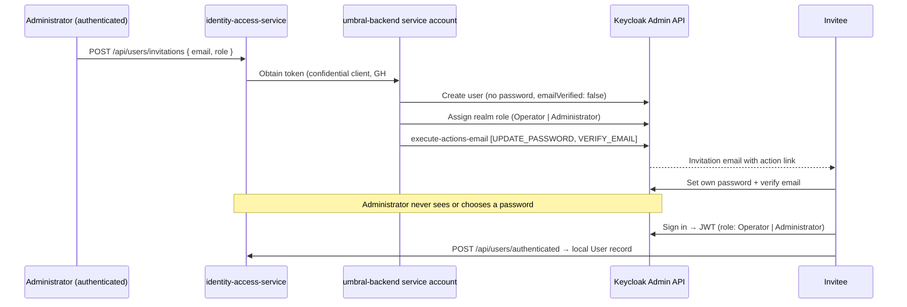

# 0016 — Account creation flow: admin-invited operators, self-registering participants

## Status

Accepted — 2026-07-10. Written **before** the implementation issues it governs
(`GH #140` confidential client, `GH #141` SMTP + `verifyEmail`, `GH #142`
invitations, `GH #143` participant self-registration, `GH #144` forgot-password),
so they build against a recorded decision rather than discovering it. Resolves
`GH #137`. Does not alter [ADR-0003](0003-api-gateway-keycloak-design-summary.md)
(gateway/Keycloak topology), [ADR-0006](0006-hu02-user-management-architecture.md)
(local `User` record + role model), [ADR-0007](0007-join-token-identity-ownership-and-non-consuming-validation.md),
or [ADR-0009](0009-resolve-operator-ownership-via-identity-actor-profile.md)
(`/api/users/me` actor-profile contract). It only decides **how a Keycloak
account and its local `User` record first come into existence**.

## Context

There is no written decision covering how accounts come into existence. Today all
four accounts (`admin`, `operator`, `operator2`, `participant`) are seeded
declaratively in `backend/deploy/keycloak/import/umbral-realm.json` with committed
passwords (`admin123`, `operator123`, `participant123`). The realm sets
`registrationAllowed: false` (`umbral-realm.json:5`), so there is **no** runtime
account-creation path at all:

- `KeycloakAdminService`
  (`services/identity-access-service/src/Infrastructure/Identity/Keycloak/KeycloakAdminService.cs`)
  only **syncs role mappings and enabled-state onto accounts that already exist**
  (`SyncUserRoleAsync:30`, `SyncUserActiveStateAsync:48`). It creates no users.
- `POST /api/users/authenticated` (`UsersController.cs:17` → `AuthenticateUserCommand`)
  only provisions the **local** `User` record from a validated JWT on first
  sign-in — it does not create the Keycloak identity that minted the JWT.
- `PATCH /api/users/{id}/role` (`UsersController.cs:65` → `AssignUserRoleCommand`)
  changes the role of an existing user and syncs it to Keycloak. It cannot admit
  a new person.

Two requirements now need this settled:

- **Operators must be created by an Administrator.** There is no self-service path
  to an Operator account, by design.
- **Participants must be able to create their own account** from the mobile app.

The realm defines three realm roles — `Administrator`, `Operator`, `Participant`
(`umbral-realm.json:10,14,18`) — and `umbral-mobile` is a public client
(`umbral-realm.json:72`, `publicClient: true`) with **direct access grants
enabled** (`umbral-realm.json:77`, `directAccessGrantsEnabled: true`).

**Mobile does not use Keycloak's hosted pages.** Login today is a **custom
email/password form** rendered by the app (`mobile/src/app/(auth)/login.tsx`) that
calls `signInWithPassword` (`mobile/src/lib/auth/keycloak.ts:65`), which posts
`grant_type: password` (Resource Owner Password Credentials / ROPC) straight to
the realm token endpoint (`keycloak.ts:71`). No browser redirect, no hosted login
screen — the app owns the UI and delegates only the credential exchange to
Keycloak. **Participant registration deliberately mirrors this pattern:** a custom
mobile-rendered form that delegates the privileged Keycloak work to the backend,
not a redirect to a Keycloak-hosted registration page.

The design tension is that **Keycloak already owns** password policy, email
verification, credential reset, and rate limiting. Any account-creation path we
add must **delegate** to those rather than re-implement them, and must not turn the
service account that holds `manage-users` into an open door to user
administration. The decision below keeps that delegation while preserving the
custom-form UX already established by login.

## Decision

**Account creation and role assignment are separate privileges. Only role
assignment is guarded.** Anyone may become a `Participant`; becoming an `Operator`
or `Administrator` always requires an existing Administrator's act.

### 1. Participants — custom mobile form delegating to a backend register endpoint

Registration follows the same shape as login: the mobile app renders its own form
and delegates the Keycloak work to identity-access-service. Concretely:

- Mobile renders a **custom registration form** (its own fields: display name,
  email, password), mirroring `login.tsx`. It does **not** open a Keycloak hosted
  page.
- The form POSTs to a **new** `POST /api/users/register` endpoint on
  identity-access-service (`GH #143`). The endpoint is **anonymous** — a person
  registering has no account yet, exactly as the login token call is unauthenticated.
- The endpoint provisions the identity in **Keycloak via the admin API**,
  authenticating as the **`umbral-backend` service account** (the confidential
  client established by `GH #140`). This is the first user-*creating* call on
  `KeycloakAdminService`, which today only syncs role/enabled-state onto existing
  users (`SyncUserRoleAsync:30`) and will gain a create path.
- The endpoint **assigns the `Participant` realm role and only that role**. The
  role is **server-enforced** (hard-coded in the command), never read from the
  request body, so the register path can never mint an `Operator` or
  `Administrator`.
- The account is created `emailVerified: false`; the service triggers Keycloak's
  `execute-actions-email` with `["VERIFY_EMAIL"]` (the same mechanism the
  invitation flow uses), so **email verification stays in Keycloak**.
- On the first successful sign-in (the existing custom ROPC login), the existing
  `POST /api/users/authenticated` provisions the local `User` record from the JWT
  — unchanged.

`registrationAllowed` stays **`false`**: self-registration goes through our
endpoint, not Keycloak's hosted registration page, so the realm flag is never
flipped and `Participant` never becomes the realm *default* role. The service
attaches `Participant` explicitly on each created account.

```mermaid
sequenceDiagram
    participant M as umbral-mobile (custom form)
    participant API as identity-access-service
    participant SA as umbral-backend service account
    participant KC as Keycloak Admin API
    M->>API: POST /api/users/register { displayName, email, password }
    API->>API: Validate input; role is server-fixed to Participant
    API->>SA: Obtain token (confidential client, GH #140)
    SA->>KC: Create user (password credential, emailVerified: false)
    SA->>KC: Assign realm role Participant (never from request body)
    SA->>KC: execute-actions-email [VERIFY_EMAIL]
    KC-->>API: Created
    API-->>M: 201 (account provisioned)
    Note over M,API: Same custom-form + backend-delegation pattern as login (ROPC)
    M->>KC: Sign in (ROPC, grant_type: password) → JWT (role: Participant)
    M->>API: POST /api/users/authenticated (Bearer JWT)
    API->>API: Provision local User record from JWT (first sign-in)
    API-->>M: Local profile
```

#### Consequences of an anonymous register endpoint, and how they are mitigated

An unauthenticated `POST /api/users/register` that reaches a `manage-users` service
account is a real attack surface. We accept it — a public sign-up API is inherently
anonymous — and contain it rather than avoid it:

- **Anonymous, but narrowly scoped.** The endpoint's only capability is *create a
  Participant*. The role is fixed server-side and is not accepted from the request,
  so the anonymous caller cannot select `Operator`/`Administrator` or otherwise
  reach user administration. Elevation is a separate, guarded act (see §3) and is
  never reachable from this path.
- **The privileged credential never leaves the server.** The `umbral-backend`
  service-account secret (`GH #140`) lives in identity-access-service
  configuration; the mobile client only ever sees `POST /api/users/register`. The
  service is the trust boundary — same posture as any backend that fronts a
  privileged admin API.
- **Password policy stays in Keycloak.** The chosen password is forwarded to
  Keycloak on the admin create-user call; realm password policy remains the source
  of truth and is not re-implemented in the service. (If Keycloak's admin-create
  path does not itself enforce the realm policy for a given deployment, the service
  validates against that same policy before the call — the policy definition still
  lives only in the realm, never duplicated as service logic.)
- **Email verification stays in Keycloak.** The account is created
  `emailVerified: false` and verification is delegated via `execute-actions-email`
  `[VERIFY_EMAIL]` — the same delegated mechanism as invitations (§2), so nothing
  is rebuilt.
- **Abuse protection must be added deliberately.** Keycloak's hosted registration
  would have supplied bot/rate-limit protection for free; because we own the
  endpoint, `GH #143` must add **input validation and rate limiting** (per-IP /
  per-email throttling at the gateway or service) so the anonymous route cannot be
  used to spray account creation or probe email existence.
- **Uniqueness and conflicts are Keycloak's.** Duplicate email/username is rejected
  by Keycloak; the endpoint surfaces the conflict as a clean error rather than
  tracking uniqueness itself.

The rejected alternative here is **Keycloak's hosted registration page**. It would
have handed us rate limiting and policy enforcement for free, but it breaks the
custom-form UX the app already commits to for login, forces a browser redirect out
of a native flow, and would require flipping `registrationAllowed` and making
`Participant` the realm default role. Mirroring the established login pattern is
worth the mitigations above.

### 2. Operators and additional Administrators — invitation, never self-service

An Administrator posts `{ email, role }` to a new `POST /api/users/invitations`.
The service, authenticated as the **`umbral-backend` service account** (the
confidential client established by `GH #140` — *not* the shared `admin-cli`
password grant used today), performs the Keycloak admin calls:

1. Create the Keycloak user with **no password** and `emailVerified: false`.
2. Assign the requested realm role (`Operator` or `Administrator`).
3. Call Keycloak's `execute-actions-email` with
   `["UPDATE_PASSWORD", "VERIFY_EMAIL"]`.

The invitee sets their **own** password from the emailed link; the Administrator
never sees or chooses a password. Because the account is created with no
credential, the invite link is the only way in until the invitee completes it.

This differs deliberately from the participant path (§1): an invited
Operator/Administrator is created **with no password** and sets it from an action
email, whereas a self-registering Participant supplies their own password on the
custom form up front. Both delegate credential and email policy to Keycloak; only
the *who chooses the password, and when* differs.

The admin dashboard affordance follows the same language: it should expose an
Administrator-only **Invite operator** action, not a self-service or
"register operator" path. The frontend submits the invitee email and requested
role to `POST /api/users/invitations`; identity-access-service performs the
privileged Keycloak calls and sends the action email. The existing dashboard has a
`Users` panel and operator-assignment panel, but no operator-invitation form yet;
that UI belongs with the invitation work in `GH #142`.



### 3. Elevation — the second supported path to Operator/Administrator

A person who self-registered as a `Participant` can be **promoted** by an
Administrator via the existing `PATCH /api/users/{id}/role`
(`AssignUserRoleCommand`, `UsersController.cs:65`), which already syncs the new
role to Keycloak (`KeycloakAdminService.SyncUserRoleAsync:30`).

- **Invitation** (§2) is for people **not yet in the system**.
- **Elevation** (§3) is for people **already in it**.

Both are Administrator-only acts. Neither is reachable by a self-registering
participant.

### 4. Bootstrap — the first Administrator

The first Administrator cannot be created by an Administrator, so it comes from
outside these flows:

- **In development** it comes from the realm import (`umbral-realm.json` seeds
  `admin` / `admin123`).
- **In production it must not.** `admin123` — and the other seed passwords
  (`operator123`, `participant123`) — are **committed to this repository**. They
  are **dev-only** and must never reach a production realm. Production obtains its
  first Administrator from an **env-provided one-shot bootstrap** (a first-run
  credential injected from configuration/secret, not source) **or manually via the
  Keycloak admin console**. No committed password may authenticate against a
  production realm.

## Consequences

- **A new anonymous `POST /api/users/register` endpoint and command** are
  introduced by `GH #143`. It is server-scoped to creating `Participant`-only
  accounts (role fixed in the command, never from the request), delegates password
  and email-verification policy to Keycloak, and must ship with input validation
  and rate limiting to compensate for being anonymous.
- **`registrationAllowed` stays `false`** and `Participant` is **not** made the
  realm default role. Self-registration runs through our endpoint, which assigns
  `Participant` explicitly; the Keycloak hosted-registration flag is never enabled.
- **Registration and login share one shape.** Both are custom mobile forms that
  delegate the Keycloak exchange to the backend/token endpoint (register → admin
  API via the service account; login → ROPC token call, `keycloak.ts:65`). No
  Keycloak-hosted page is introduced on either path.
- **A new `POST /api/users/invitations` endpoint and command** are introduced by
  `GH #142`, guarded to Administrators, driving the no-password +
  `execute-actions-email` flow above.
- **The admin frontend needs an `Invite operator` affordance** once `GH #142`
  lands. It should live in the admin dashboard/users area, submit email + role to
  `POST /api/users/invitations`, and avoid wording that implies operators can
  self-register.
- **Both create paths depend on the confidential client (`GH #140`) and SMTP
  (`GH #141`).** The service must authenticate as `umbral-backend` rather than the
  current `admin-cli` password grant (`KeycloakAdminService.GetAdminTokenAsync:158`),
  and `execute-actions-email` / `VERIFY_EMAIL` only work once an SMTP server is
  configured — otherwise verification mail never sends (the reason `GH #141` ships
  SMTP and `verifyEmail` together).
- **The `manage-users` service account is reachable anonymously only through the
  register endpoint, and only to create a Participant.** Every other privileged
  Keycloak admin call (invitation, elevation, deactivation) sits behind an
  Administrator-authenticated request. The register path's blast radius is bounded
  to Participant creation by server-side role enforcement plus rate limiting.
- **Password handling stays in Keycloak.** identity-access-service forwards a
  password on the register path but neither stores it nor defines the policy that
  governs it; invitees set theirs from the action email; the realm remains the sole
  owner of password policy, verification, and reset.
- **The committed dev passwords remain a production hazard until deployment
  hardening lands.** This ADR records the rule; enforcing it (env-provided
  bootstrap, production realm without seeded credentials) is deployment work, not
  covered here.
